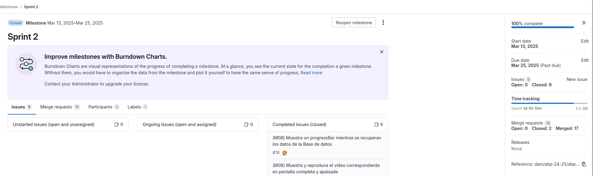

# GITLAB
En aquest apartat es pot veure els 3 sprints que hem fet per a poder completar el projecte.

## Sprint 1

## Sprint 2

## Sprint 3

# MockUp
En aquest apartat es pot veure el mockup que he fet amb l'eina de Figma.

## Login

## Sign Up

## Animes

## Favorito

## Anime Detail
Anime detail és el mismo para favoritos

## Perfil/Configuración de usuario

# App
En aquest apartat pots comparar el mockup amb el producte final.

## Login

## Sign Up

## Animes

## Favorito

## Anime Detail
Anime detail és el mismo para favoritos

## Perfil/Configuración de usuario

# Test Unitaris
Aquí pots veure els tests unitaris que hem passat amb el Intellij

